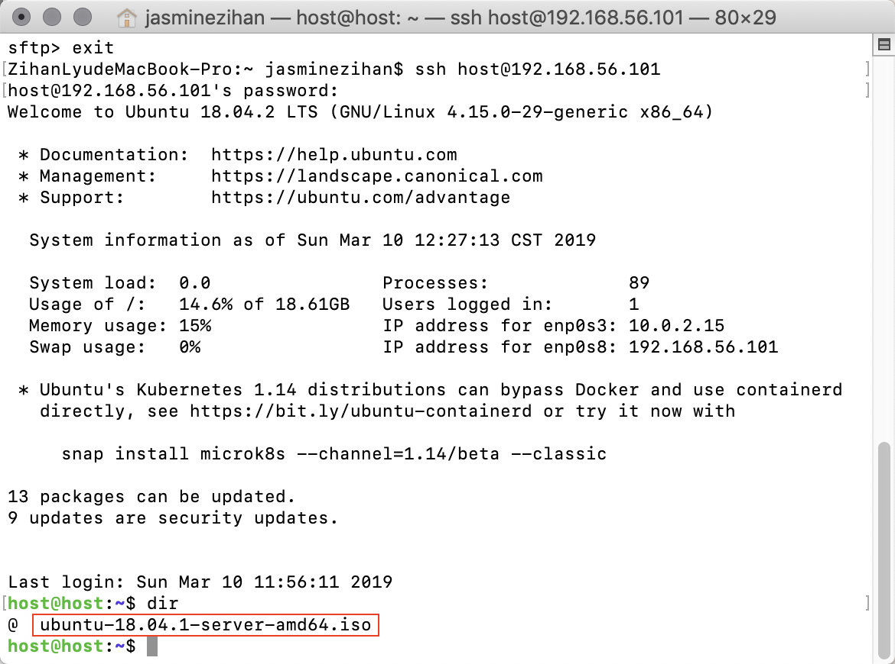

# VirtualBox 无人值守安装Unbuntu系统实验

### 一.实验要求

- 配置无人值守安装iso并在Virtualbox中完成自动化安装
- Virtualbox安装完Ubuntu之后新添加的网卡实现系统开机自动启用和自动获取IP
- 使用sftp在虚拟机和宿主机之间传输文件

### 二.实验过程

- 实验环境：

  ubuntu-18.04.1-server-amd64.iso

  VirtualBox

- 开启虚拟机的两块网卡<br>网卡二host-only网卡设置开机自启动，自动获取IP地址

  - 配置dhcp<br>

  - 更改网络配置<br>

    <br>

  - 网络自启动成功

    

- 利用ssh远程连接虚拟机

  ```
   # 利用sftp将iso镜像上传到虚拟机
   put -r /Users/jasminezihan/Downloads/ubuntu-18.04.1-server-amd64.iso /home/host
  ```

  

  

  <br><br>

- 根据实验指导进行实验内容如下

  ```
   # 在当前用户目录下创建一个用于挂载iso镜像文件的目录
    mkdir loopdir
    
    # 挂载iso镜像文件到该目录
    mount -o loop ubuntu-16.04.1-server-amd64.iso loopdir
    
    # 创建一个工作目录用于克隆光盘内容
    mkdir cd
     
    # 同步光盘内容到目标工作目录
    # 一定要注意loopdir后的这个/，cd后面不能有/
    rsync -av loopdir/ cd
  ```

  

  ```
    
    # 卸载iso镜像
    umount loopdir
    
    # 进入目标工作目录
    cd cd/
  ```

  

  ```
    
    # 编辑Ubuntu安装引导界面增加一个新菜单项入口 
    vim isolinux/txt.cfg
    
    # 将以下内容添加到txt.cfg中然后强制保存退出
    label autoinstall
     menu label ^Auto Install Ubuntu Server
     kernel /install/vmlinuz
     append  file=/cdrom/preseed/ubuntu-server-autoinstall.seed debian-installer/locale=en_US console-setup/layoutcode=us keyboard-configuration/layoutcode=us console-setup/ask_detect=false localechooser/translation/warn-light=true localechoosertranslation/warn-severe=true initrd=/install/initrd.gz root=/dev/ram rw quiet
  ```

  

  ```
   # 将定制好的种子文件命名为ubuntu-server-autoinstall.seed并上传至preseed     
   # 文件夹里
   ~/cd/preseed/ubuntu-server-autoinstall.seed
  
   # 修改isolinux/isolinux.cfg，增加内容timeout 10
  ```

  <br>

  <br>

  

  ```
   # 重新生成md5sum.txt
   cd ~/cd && find . -type f -print0 | xargs -0 md5sum > md5sum.txt
  
   # 重新封装为custom.iso
   IMAGE=custom.iso
   BUILD=~/cd/
  
   mkisofs -r -V "Custom Ubuntu Install CD" \
              -cache-inodes \
              -J -l -b isolinux/isolinux.bin \
              -c isolinux/boot.cat -no-emul-boot \
              -boot-load-size 4 -boot-info-table \
              -o $IMAGE $BUILD
  ```

  

  

  

  ```
   # 利用psftp将iso下载到本地实验环境
   get /home/host/cd/custom.iso /Users/jasminezihan/Documents
   
   # 开始无人值守自动安装
  ```

  

  

  

  

  *注意：过程中用sudo提权，以完成root操作*

- 如何使新添加的网卡实现系统开机自动启用和自动获取IP？

  ```
   # 该指令可以打开host-only网卡，但在每次重启后会失效
   sudo dhclient enp0s8
   
   # 在更改网络配置文件interfaces之后设置dhcp自动获取IP地址，如开头操作即可自启动网卡
  ```

- 如何使用sftp在虚拟机和宿主机之间传输文件？

  ```
  	# 打开终端，连接远程Linux
  	sftp host@192.168.56.101
  	
  	#上传文件
  	put -r local_path/file remote_path
  	
  	#下载文件
  	get remote_path/file local_path
  ```


### 三.实验思考

- 利用在线文档比对工具对比定制文件与官方文档

  - 选择支持地点，跳过语言询问

  

  - 修改链接等待超时时长

  - 修改dhcp超时时长
  - 不允许自动配置网络

  

  - 配置网卡静态IP地址、网络掩码、网关地址和域名服务器

  

  - 设置默认主机名、域名，强制主机名为isc-vm-host

  

  - 设置用户名为cuc，密码及确认密码为sec.cuc.edu.cn

  

  - 设置时区为亚洲/上海，并关闭ntp时钟设置

  

  - 设置最大空闲空间分区自动分区

  

  - 对于lvm分区方法，使用尽可能多地逻辑卷组
  - 选择分区目录：/home /var/ tmp分离的分区

  

  

  - 不使用网络镜像

  

  - 选用server安装包，安装openssh服务，无人值守自动更新系统软件

  


[无人值守安装镜像视频链接](https://v.youku.com/v_show/id_XNDA5NTI2MzE3Mg==.html?spm=a2h3j.8428770.3416059.1)