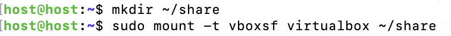

## 动手实践SYSTEMD

- 实验目的：学习理解systemd系统守护进程相关指令并能加以利用


- Systemd入门教程：命令篇

  - systemctl 主命令，用于管理系统

    ```bash
    # 重启系统
    $ sudo systemctl reboot
    
    # 关闭系统，切断电源
    $ sudo systemctl poweroff
    
    # CPU停止工作
    $ sudo systemctl halt
    
    # 暂停系统
    $ sudo systemctl suspend
    
    # 让系统进入冬眠状态
    $ sudo systemctl hibernate
    
    # 让系统进入交互式休眠状态
    $ sudo systemctl hybrid-sleep
    
    # 启动进入救援状态（单用户状态）
    $ sudo systemctl rescue
    ```

    systemd-analyze 查看启动耗时

    hostnamectl 查看当前主机信息

    localectl 查看本地化设置

    timedatectl 查看当前时区设置

    loginctl 查看当前登陆的用户

    - [systemd系统管理命令](<https://asciinema.org/a/5LOUZv072Cpk2hMXXmww34Ezf>)

  - Unit+Target+日志管理

    - [systemd其他指令](https://asciinema.org/a/RI4RAwb8nTbEsskmcBIqaiEvw)

- systemd入门教程：实战篇

  ```bash
  # 设置服务开机自启动
  	sudo systemctl enable apache2
  # 启动服务
  	sudo systemctl start apache2
  # 查看服务状态
  	sudo systemctl status apache2
  # 停止服务
  	sudo systemctl stop apache2
  # 查看固定服务的配置文件
  	systemctl cat apache2.service
  # 查看target的配置文件
  	systemctl cat multi-user.target
  ```

  - [Systemd实战](https://asciinema.org/a/xVuLv1CaStV8I9X2tpM1BOmFh)

  ```bash
  Service的配置文件有三个区块
  - [Unit] 区块：启动顺序与依赖关系
  	Description字段给出当前服务的简单描述，Documentation字段给出文档位置，After字段表示该服务在某些服务后启动，Before字段定义该服务应该在哪些服务之前启动，Wants弱依赖，Requires强依赖
  - [Service] 区块：启动行为
  	ExecStart字段：定义启动进程时执行的命令
  	ExecReload字段：重启服务时执行的命令
  	ExecStop字段：停止服务时执行的命令
  	ExecStartPre字段：启动服务之前执行的命令
  	ExecStartPost字段：启动服务之后执行的命令
  	ExecStopPost字段：停止服务之后执行的命令
  	KillMode字段：定义 Systemd 如何停止 sshd 服务
  	Restart字段：定义了 sshd 退出后，Systemd 的重启方式
  	RestartSec字段：表示 Systemd 重启服务之前，需要等待的秒数。上面的例子设为等待42秒
  - [Install] 区块：定义如何安装这个配置文件，即怎样做到开机启动
  ```

- 自查清单

  - 如何添加一个用户并使其具备sudo执行程序的权限？

    ```bash
    # 添加新用户
    	sudo adduser <username>
    # 添加用户至sudo用户组
    	sudo usermod -a -G <groupname> <username>
    ```

    

  - 如何将一个用户添加到一个用户组？

    ```bash
    # 添加一个新用户至附加用户组
    	useradd -G {groupname} username
    # -G参数是为了将用户添加到一个附加用户组中，而同时还会为此用户创建一个属于他自己的新组。如果要将该用户同时增加到多个附加用户组中，可以使用逗号来分隔多个附加组名
    
    # 增加一个新用户到主要用户组
    	adduser -g {groupname} username
    # -g将新增加的用户初始化为指定为登录组（主要用户组）此组名必须已经存在。
    
    # 将一个已有用户增加到一个已有用户组中
    	usermod -a -G {groupname} username
    #-a 代表 append， 也就是将用户添加到新用户组中而不必离开原有的其他用户组,需要与 -G 选项配合使用
    ```

    

  - 如何查看当前系统的分区表和文件系统详细信息？

    ```bash
    # 查看系统的分区表
    	fdisk -l
    # 展示磁盘使用情况(文件系统详细信息)
    	df -T
    ```

    

    

  - 如何实现开机自动挂载Virtualbox的共享目录分区？

    ```bash
    # 在主机中设置共享文件夹路径 virtualbox
    # 在Linux中新建共享文件夹
    	mkdir ~/share
    # 挂载共享文件夹
    	sudo mount -t vboxsf virtualbox ~/share
    # 在Linux中以sudo权限在/etc/fstab文件末尾添加一行:virtualbox ~/share vboxsf defaults 0 0
    # 在文件 /etc/rc.local 中（用root用户）追加挂载命令
    	mount -t vboxsf virtualbox ~/share
    ```

    

    

  - 基于LVM（逻辑分卷管理）的分区如何实现动态扩容和缩减容量？

    ```bash
    # 安装lvm2
    sudo apt-get install lvm2
    
    # 查看逻辑卷信息
    sudo lvdisplay
    
    # 扩容
    sudo lvextend --size +<size> /dev/host-vg/root
    
    # 缩容
    sudo lvreduce --size -<size> /dev/host-vg/root
    ```

    

  - 如何通过systemd设置实现在网络连通时运行一个指定脚本，在网络断开时运行另一个脚本？

    ```bash
    # 修改NetworkManager.service配置文件的Service区块
    # 网络连通时运行a.service
    ExecStartPost = a.service
    
    # 网络断开时运行b.service
    ExecStopPost = b.service
    ```

  - 如何通过systemd设置实现一个脚本在任何情况下被杀死之后会立即重新启动？实现**杀不死**？

    ```bash
    修改Unit文件中Service区块的Restart内容：定义服务always重启。
    可能的值包括 always（总是重启）、on-success、on-failure、on-abnormal、on-abort、on-watchdog
    ```

- 参考链接

  [Systemd入门教程：命令篇](http://www.ruanyifeng.com/blog/2016/03/systemd-tutorial-commands.html)

  [Systemd入门教程：实战篇](http://www.ruanyifeng.com/blog/2016/03/systemd-tutorial-part-two.html)

  [Systemd服务管理](https://blog.mallux.me/2017/02/13/systemd/)

  


​    