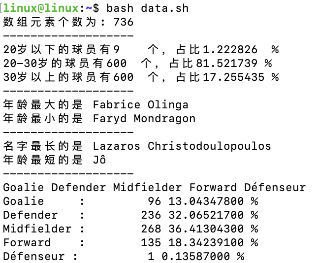
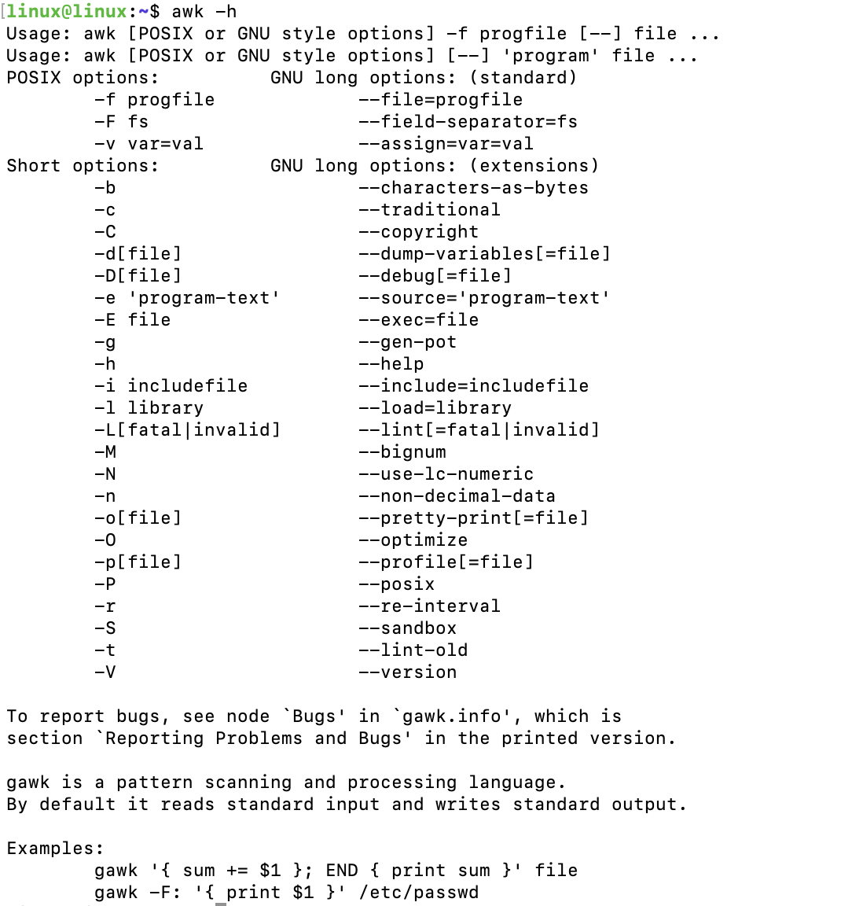
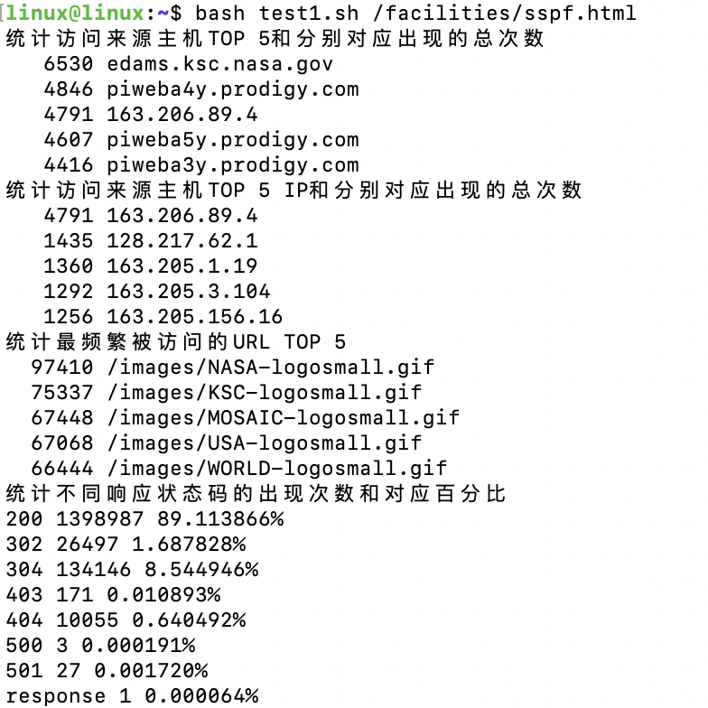
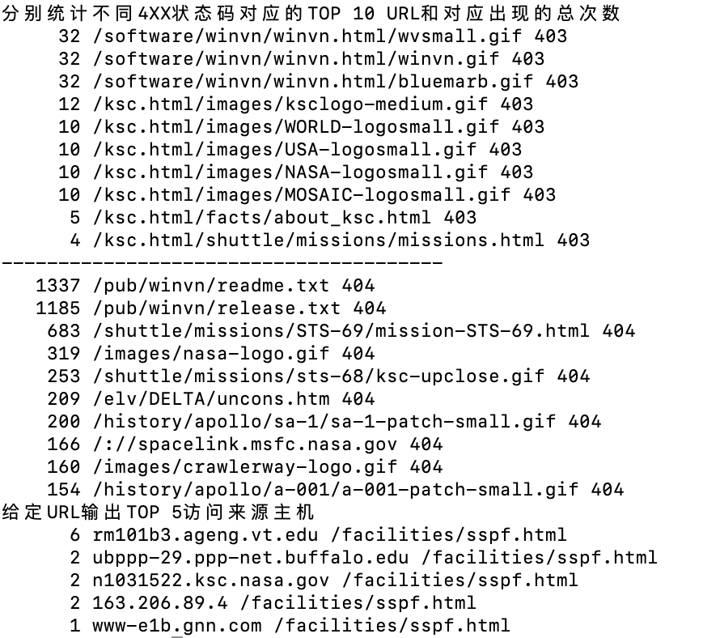
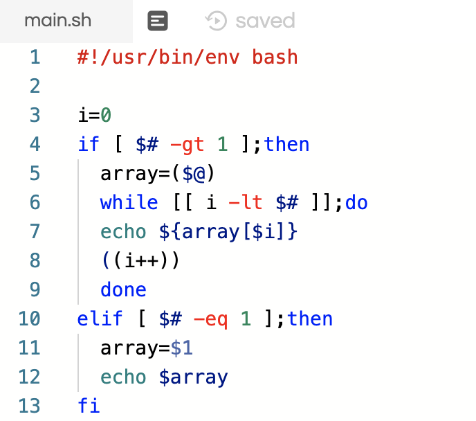
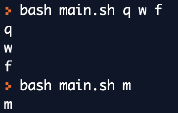

## Shell 脚本编程基础

- 任务二:用bash编写一个文本批处理脚本，对[2014世界杯运动员数据](http://sec.cuc.edu.cn/huangwei/course/LinuxSysAdmin/exp/chap0x04/worldcupplayerinfo.tsv)附件分别进行批量处理完成相应的数据统计任务

  - 统计不同年龄区间范围（20岁以下、[20-30]、30岁以上）的球员**数量**、**百分比**
  - 统计不同场上位置的球员**数量**、**百分比**
  - 名字最长的球员是谁？名字最短的球员是谁？
  - 年龄最大的球员是谁？年龄最小的球员是谁？

  ```bash
  #!/usr/bin/env bash
  
  # 统计不同年龄区间的球员数量和百分比
  function cal_age {
    count_20=0
    count_25=0
    count_30=0
    i=0
    for i in ${age[@]};do
      if [ $i -lt 20 ]
      then
      ((count_20++))
      elif [ $i -gt 30 ]
      then
      ((count_30++))
      else
      ((count_25++))
      fi
    done
   
    printf "20岁以下的球员有%-5d个，占比%-10.6f%% \n" $count_20 $(echo "scale=10; $count_20/$count*100" | bc -l| awk '{printf "%f", $0}') 
    printf "20-30岁的球员有%-5d个，占比%-10.6f%% \n" $count_25 $(echo "scale=10;$count_25/$count*100" |bc -l | awk '{printf "%f",$0}')
    printf "30岁以上的球员有%-5d个，占比%-10.6f%% \n" $count_25 $(echo "scale=10;$count_30/$count*100" |bc -l | awk '{printf "%f",$0}')
  }
  
  # 统计名字最长和最短的球员
  function get_length {
    i=0
    max_name=0
    min_name=100
    while [[ i -lt $count ]];do
      name=${player[$i]//\*/}
      n=${#name}
      if [[ n -gt max_name ]];then
        max_name=$n
        max_num=$i
      elif [[ n -lt min_name ]];then
        min_name=$n
        min_num=$i
      fi
      ((i++))
    done
    # echo $max_num
    # echo $min_num
    echo "名字最长的是 ${player[max_num]//\*/ }"
    echo "名字最短的是 ${player[min_num]}"
  }
  
  # 统计年龄最大和最小的球员
  function get_oldest {
    oldest=0
    youngest=100
    i=0
    while [[ i -lt $count ]];do
      a=age[$i]
      if [[ a -lt $youngest ]];then
        youngest=$a
        max_num=$i
      elif [[ a -gt $oldest ]];then
        oldest=$a
        min_num=$i
      fi
      ((i++))
    done
    # echo $max_num
    # echo $min_num
    echo "年龄最大的是 ${player[max_num]//\*/ }"
    echo "年龄最小的是 ${player[min_num]//\*/ }"
  }
  
  # 计算不同场上位置的球员数量和百分比
  function cal_position {
    array=($(awk -vRS=' ' '!a[$1]++' <<< ${position[@]})) 
    echo ${array[@]}
    i=0
    declare -A member
    for((i=0;i<${#array[@]};i++))
    {
      m=${array[$i]}
      member["$m"]=0
    }
    for each in ${position[@]};do
      # echo $each
      case $each in
      ${array[0]})
      ((member["${array[0]}"]++));;
      ${array[1]}) 
      ((member["${array[1]}"]++));;
      ${array[2]}) 
      ((member["${array[2]}"]++));;
      ${array[3]}) 
      ((member["${array[3]}"]++));;
      ${array[4]})
      ((member["${array[4]}"]++));;
      esac
    done
  for((i=0;i<${#array[@]};i++))
  {
    temp=${member["${array[$i]}"]}
    printf "%-10s : %10d %10.8f %% \n" ${array[$i]} $temp $(echo "scale=10; $temp/$count*100" | bc -l| awk '{printf "%f", $0}')
  }
  
  }
  
  # 主程序入口
  count=0	#计数器，计算数据总量
  while read line
  do
  ((count++))
  if [ $count -gt 1 ];then
  	#将字符串中所有空格全部转换为*并以/t作为分隔符进行分割得到数组
    str=(${line// /*})	
    position[$(($count-2))]=${str[4]}
    age[$(($count-2))]=${str[5]}
    player[$(($count-2))]=${str[8]}
  fi
  done < worldcupplayerinfo.tsv
  count=$(($count-1))
  echo "数组元素个数为: $count"
  # echo "${#player[@]}"
  # echo "${player[0]}"
  echo "-------------------"
  cal_age
  echo "-------------------"
  get_oldest
  echo "-------------------"
  get_length
  echo "-------------------"
  cal_position
  ```

  观察tsv我们可以发现每条数据独立成行，通过'\t'分隔为10个域,由于存在名字之间有空格的球员或地名，因此对数据预处理，将数据中的空格替换掉，($string)操作可以将字符串按照空格进行分割得到数组。由于我们只需要场上位置、年龄和球员名字三个有效信息，因此用三个数组记录他们的值即可，第一行是列名不包含实际数据，因此可以直接忽略。在遍历完文件，将所有有效数据都存入数组后进行的

  ```count=$((​$count-1))```操作也是为了去除第一条数据影响记录数据总量的。

  统计年龄区间的函数，通过遍历age数据，在范围内进行计数器自加即可获取结果；统计年龄大小和名字长度的函数都需要同时记录最值和最值的下标，以便最终输出球员的名字；记录场上位置的函数，先对position数据进行去重，得到五个不同的位置，使用字典，键为位置，值初设唯一，用case选择结构对每个数据的position进行判断，满足键相同的值就自加，最终输出结果和百分比即可。

- 输出结果

  

- 问题

  1. 第一次处理时，并未将数据中的空格替换为*导致数据分割时将名字中带有空格的球员也进行了分隔，得到的域多于10个并且无法根据数组下标获取到正确的域内容
  2. 记录切割好的数据进数组时，第一次没有控制count变量的值，导致数组第一个数是从下标为2开始的，在后续获取数据输出时发生了问题
  3. 统计名字长度的函数，最先开始没有将*去除，导致长度计算时包含了名字建空格的长度，最终得到不对的结果，因此在计算每个名字长度之前应该先预处理去除名字内的空格

- 参考

  [shell 字符串操作](https://www.cnblogs.com/gaochsh/p/6901809.html)

  [shell编程的case多分支语句](https://blog.csdn.net/dreamtdp/article/details/8048720)

- 任务三：用bash编写一个文本批处理脚本，对[Web服务器访问日志](http://sec.cuc.edu.cn/huangwei/course/LinuxSysAdmin/exp/chap0x04/web_log.tsv.7z)附件分别进行批量处理完成相应的数据统计任务

  - 统计访问来源主机TOP 100和分别对应出现的总次数
  - 统计访问来源主机TOP 100 IP和分别对应出现的总次数
  - 统计最频繁被访问的URL TOP 100
  - 统计不同响应状态码的出现次数和对应百分比
  - 分别统计不同4XX状态码对应的TOP 10 URL和对应出现的总次数
  - 给定URL输出TOP 100访问来源主机

  ```bash
  #!/usr/bin/env bash
  
  echo "统计访问来源主机TOP 5和分别对应出现的总次数"
  cat web_log.tsv|awk -F'\t' '{print $1}'|sort|uniq -c|sort -nr|head -n 5
  echo "统计访问来源主机TOP 5 IP和分别对应出现的总次数"
  cat web_log.tsv|awk -F'\t' '{print $1}'|grep -E "^[0-9]"|sort|uniq -c|sort -nr|head -n 5
  echo "统计最频繁被访问的URL TOP 5"
  cat web_log.tsv|awk -F'\t' '{print $5}'|sort|uniq -c|sort -nr|head -n 5
  echo "统计不同响应状态码的出现次数和对应百分比"
  cat web_log.tsv| awk '{a[$6]++;s+=1}END{for (i in a) printf "%s %d %6.6f%%\n", i, a[i], a[i]/s*100}'|sort
  echo "分别统计不同4XX状态码对应的TOP 10 URL和对应出现的总次数"
  cat web_log.tsv|awk -F'\t' '{if($6=="403")print $5,$6}'|sort|uniq -c|sort -nr|head -n 10
  echo "---------------------------------------"
  cat web_log.tsv|awk -F'\t' '{if($6=="404")print $5,$6}'|sort|uniq -c|sort -nr|head -n 10
  echo "给定URL输出TOP 5访问来源主机"
  url=$1
  cat web_log.tsv|awk -F'\t' '{if($5=="'$url'")print $1,$5}'|sort|uniq -c|sort -nr|head -n 5
  
  ```

  awk利用C语言结构书写是处理数据非常便捷的算法结构。awk以\n为界限去识别一条数据，-F参数表示用指定的标识符分隔每个段，在输出时通过$加数字来控制想要输出的域。后面的参数中，sort是计数，uniq -c是去重分组，sort -nr是从大到小排序，grep - E 是控制匹配原则，head -n是控制输出个数。由于awk遵循c语言结构因此可以使用if语句来筛选需要输出的成分。

  

  问题：在开始想要利用正则进行匹配时使用了{/正则规则/print $1}这样的结构，但发现该匹配方式不能对指定的域进行匹配，因此只能通过固定域的if语句和grep进行控制输出。

- 输出结果

  

  

- 参考

  [linux统计数据出现次数并排序](https://blog.csdn.net/fallish/article/details/7403059)

  [awk使用教程](https://www.cnblogs.com/ggjucheng/archive/2013/01/13/2858470.html)

- 任务一:用bash编写一个图片批处理脚本，实现以下功能：

  - 支持命令行参数方式使用不同功能
  - 支持对指定目录下所有支持格式的图片文件进行批处理
  - 支持以下常见图片批处理功能的单独使用或组合使用
    - 支持对jpeg格式图片进行图片质量压缩
    - 支持对jpeg/png/svg格式图片在保持原始宽高比的前提下压缩分辨率
    - 支持对图片批量添加自定义文本水印
    - 支持批量重命名（统一添加文件名前缀或后缀，不影响原始文件扩展名）
    - 支持将png/svg图片统一转换为jpg格式图片

  ```bash
  #!/usr/bin/env bash
  Dir="/home/hadoop/Douments/pic"
  out=$Dir/out
  mkdir -p $out
  
  # 帮助
  function help {
    echo "the options:"
  	echo "-c	input quality to compress JPEG images"
  	echo "-h	get the help of the operations"
  	echo "-v	turn all png/svg picture into JPEG"
  	echo "-s	input size to resize the JPEG/PNG/SVG picture"
  	echo "-a	add text into the picture"
  	echo "-n	rename all the png/svg picture"
  }
  
  # JPEG图像压缩
  function compress {
    quality=$1
    for file in `ls $dir`
    do
      extension=${file##*.}
      echo $extension
      if [ $extension == "jpg" ];then
        echo "compressing........";
        out=$Dir/out/$file
        convert $file -quality $quality_num $out
      fi
    done 
  }
  
  # 重新调整图片分辨率
  function resize {
    size=$1
    for file in `ls $dir`
    do
      extension=${file##*.}
      echo $file
      if [ $extension == "jpg" ] || [ $extension == "png" ] || [ $extension == "svg" ];then
      out=$Dir/out/$file
      echo "resizing";
      convert -resize $size $file $out
      fi
    done
     
  }
  
  # 批量加入文本
  function add_text {
    color=$1
    size=$2
    text=$3
    for file in `ls $dir`
    do
      extension=${file##*.}
      echo $file
      if [ $extension == "jpg" ] || [ $extension == "png" ] || [ $extension == "svg" ];then
      echo "drawing";
      convert -fill $color -pointsize $size -draw "$text" $file
      fi
    done  
  }
  
  # 图像转为JPEG格式
  function converting {
    for file in `ls $dir`
    do
      extension=${file##*.}
      echo $file
      if [ $extension == "png" ] || [ $extension == "svg" ];then
      out=$Dir/out/${file%.*}.jpeg
      echo $out
      echo "converting";
      convert $file $out
      fi
    done 
  }
  
  # 重命名
  function rename {
    for file in `ls $dir`
    do
      echo $file
      out=$Dir/out/in_${file%.*}.${file##*.}
      echo $out
      echo "renaming";
      convert $file $out
    done
  }
  
  # 主函数入口
  while [[ "$#" -ne 0 ]]; do
   case $1 in
  	"-c") 
  			compress $2
  			shift 2;;
  	"-s")
  			resize $2
  			shift 2;;
  	"-h")
  			Operations
  			shift;;		
  	"-a") 
  			add_text $2 $3 $4
  			shift 4;;
  	"-v"）
  			converting
  			shift;;			
  	"-n")
  			rename
        shift;;		
  		esac
  done
  
  ```

  

  记录实验参数的相关操作

​	

​	