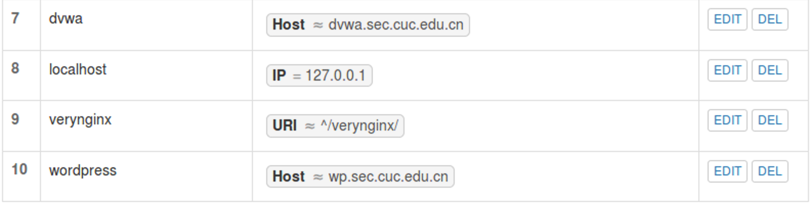
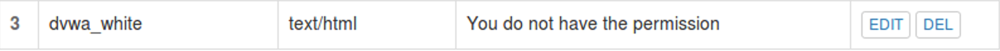
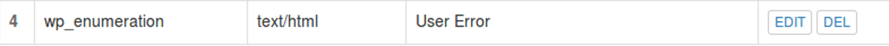
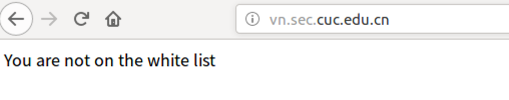
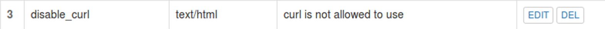

## Lab5 Web服务器配置

#### 实验环境

- ubuntu 16.04 虚拟机环境
- mac 主机环境
- nginx/verynginx

#### 安装软件配置环境

- **安装VeryNginx**

  安装git

  ```bash
  sudo apt-get update
  sudo apt install git
  ```

  克隆VeryNginx到本地

  ```bash
  git clone https://github.com/alexazhou/VeryNginx.git
  # 安装相关依赖
  sudo apt install libssl-dev libpcre3 libpcre3-dev build-essential
  cd VeryNginx
  # 安装软件
  sudo python install.py install
  ```

  启动服务

  ```bash
  sudo /opt/verynginx/openresty/nginx/sbin/nginx
  ```

  

  报错，应按照config添加相应用户nginx

  ```bash
  sudo adduser nginx
  ```

  报错，因为nginx和verynginx同时使用80端口，杀死nginx进程即可

  ```bash
  # 显示Nginx进程信息
  ps -ef | grep nginx
  sudo kill -QUIT 6625
  ```

  输入IP地址即可访问，登录的默认用户密码都是verynginx

  

  通过在虚拟机中的/etc/hosts文件中添加对应的域名和ip地址，即可通过链接直接在浏览器中通过域名访问

  

  修改nginx的默认配置文件，将服务的监听端口该为8087

  ```bash
  sudo vim /etc/nginx/sites-available/default
  # 开启Nginx服务
  sudo service nginx start
  ```

  即可通过8087端口访问到nginx的主页

  

  

- 基于LEMP安装WordPress

  配置mysql

  ```bash
  # 创建WordPress独立数据库
  CREATE DATABASE wordpress DEFAULT CHARACTER SET utf8 COLLATE utf8_unicode_ci;
  # 刷新权限
  FLUSH PRIVILEGES;
  exit
  ```

  

  安装php及扩展
  
  ```bash
  # 安装php7.0
  sudo apt install php7.0
  
  # 安装一些php扩展
sudo apt install php-curl php-gd php-mbstring php-mcrypt php-xml php-xmlrpc
  ```

  
  
  配置nginx
  
  ```bash
  # 在/etc/nginx/sites-available/目录中建立新的服务器块配置文件
  sudo vim /etc/nginx/sites-available/example.com
  # 创建符号链接来启用新服务器块
  sudo ln -s /etc/nginx/sites-available/example.com /etc/nginx/sites-enabled/
  # 从/sites-enabled/目录中取消链接默认配置文件
  sudo unlink /etc/nginx/sites-enabled/default
  # 测试新配置文件的语法错误：
sudo nginx -t
  #重新加载Nginx以进行必要的更改：
sudo systemctl reload nginx
  ```
  
  
  
  
  
  创建PHP文件以测试配置
  
  ```bash
    # 使用文本编辑器创建info.php在文档根目录中调用的测试PHP文件：
  	sudo vim /var/www/html/info.php
  ```
  
  
  
   访问该php页面
  
  使用info.php页面获取502 Bad Gateway
  
  发现是php-fpm版本不匹配
  
  ```bash
    # 在/etc/nginx/sites-available/example.com中做出如下更改，由于链接sites-enable中响应文件也会更改
    fastcgi_pass unix:/var/run/php/php7.0-fpm.sock
  ```
  
  成功访问
  
    
  
  ```bash
    # 测试完毕，键入以下命令删除文件：
    sudo rm /var/www/html/info.php
  ```
  
    在Ubuntu中安装并配置WordPress
  
  ```bash
  # 在一个可写目录下安装WordPress
    cd /tmp
    curl -O https://wordpress.org/latest.tar.gz
    
    # 解压文件以创建WordPress目录结构
    tar xzvf latest.tar.gz
    
  # 将示例配置文件复制到WordPress实际读取的文件中
    cp /tmp/wordpress/wp-config-sample.php /tmp/wordpress/wp-config.php
  
    # 将目录的全部内容复制到文档根目录中
  # -a标志用来维护权限
    sudo cp -a /tmp/wordpress/. /var/www/html
    
    # 从WordPress密钥生成器中获取安全值
    curl -s https://api.wordpress.org/secret-key/1.1/salt/
  ```
  
    将生成的内容复制到`/var/www/html/wp-config.php`中，并修改数据库的设置
  
    
  
    在浏览器中访问相应地址即可安装Wordpress
  
  ```bash
  # 在/etc/hosts中添加
    10.211.55.5 wp.sec.cuc.edu.cn
    
    # 在本机mac的/etc/hosts中添加同样的内容
    10.211.55.5 wp.sec.cuc.edu.cn
  ```
  
  
  
    即可在mac主机上通过域名访问网页
  
    
  
- 使用DVWA搭建站点

  ```bash
  # 在/var/www/html目录下为DVWA创建目录
  sudo mkdir /var/www/html/DVWA
  # 将安装仓库克隆到临时目录下
  git clone https://github.com/ethicalhack3r/DVWA /tmp/DVWA
  # 将安装文件拷贝到/var/www/html/DVWA网站根目录下 
  sudo rsync -avP /tmp/DVWA/ /var/www/html/DVWA
  # 可以验证所有DVWA源代码文件都在目录里
  ```

  

  ```bash
  # 配置DVWA数据库连接详细信息，将此配置文件重命名
  cp config.inc.php.dist config.inc.php
  # 编辑DVWA配置并调整数据库配置设置
  ```

  

  在`/etc/nginx/sites-available/example.com`中增加以下内容并保存：

  

  访问IP地址直接到达DVWA安装页面，创建数据库并用默认admin password登入

  

  

#### 基本要求实现

- 反向代理

  在VeryNginx中配置如下

  

  

- 实现使用[Wordpress](https://wordpress.org/)搭建的站点对外提供访问的地址为： https://wp.sec.cuc.edu.cn；使用[Damn Vulnerable Web Application (DVWA)](http://www.dvwa.co.uk/)搭建的站点对外提供访问的地址为： http://dvwa.sec.cuc.edu.cn

  

  

#### 安全加固要求

- 使用IP地址方式均无法访问上述任意站点，并向访客展示自定义的**友好错误提示信息页面-1**

  disable_ip matcher:

  disable_ip response:

  disable_ip fliter:

  result：

- [Damn Vulnerable Web Application (DVWA)](http://www.dvwa.co.uk/)只允许白名单上的访客来源IP，其他来源的IP访问均向访客展示自定义的**友好错误提示信息页面-2**

  dvwa_white matcher:

  dvwa_white response:

  dvwa_white fliter:

  result：

- 在不升级Wordpress版本的情况下，通过定制[VeryNginx](https://github.com/alexazhou/VeryNginx)的访问控制策略规则，**热**修复[WordPress < 4.7.1 - Username Enumeration](https://www.exploit-db.com/exploits/41497/)

  wp_enummeration matcher：

  wp_enummeration response：

  wp_enummeration fliter：

  result：

- 通过配置[VeryNginx](https://github.com/alexazhou/VeryNginx)的Filter规则实现对[Damn Vulnerable Web Application (DVWA)](http://www.dvwa.co.uk/)的SQL注入实验在低安全等级条件下进行防护

  dvwa_sql matcher：

  dvwa_sql response：

  dvwa_sql fliter：

  result：

#### VeryNginx配置要求

- [VeryNginx](https://github.com/alexazhou/VeryNginx)的Web管理页面仅允许白名单上的访客来源IP，其他来源的IP访问均向访客展示自定义的**友好错误提示信息页面-3**

  very_white matcher:

  very_white response:

  very_white fliter:

  result:

- 通过定制VeryNginx的访问控制策略规则实现：

  - 限制DVWA站点的单IP访问速率为每秒请求数 < 50
  - 限制Wordpress站点的单IP访问速率为每秒请求数 < 20
  - 超过访问频率限制的请求直接返回自定义**错误提示信息页面-4**

  Frequency limit:

  Frequency response:

  result:

  - 禁止curl访问

  disable_curl matcher:

  disable_curl response:

  disable_curl fliter:

  result:


#### 参考链接

- [How to install wordpress with LEMP on ubuntu 18.04](https://www.digitalocean.com/community/tutorials/how-to-install-wordpress-with-lemp-on-ubuntu-18-04)
- [How to install linux nginx mysql php LEMP stack ubuntu 18.04](https://www.digitalocean.com/community/tutorials/how-to-install-linux-nginx-mysql-php-lemp-stack-ubuntu-18-04)
- [How to Install and Configure DVWA Lab on Ubuntu 18.04 server](https://kifarunix.com/how-to-setup-damn-vulnerable-web-app-lab-on-ubuntu-18-04-server/)
- [linux-2019-luyj](https://github.com/CUCCS/linux-2019-luyj/blob/Linux_exp0x05/Linux_exp0x05/Linux_exp0x05.md)
- [linux-2019-Cassie8888](https://github.com/CUCCS/linux-2019-Cassie8888/blob/037f4d4d152ca61f2a3afcf85c0027542d8cc535/linux05/%E5%AE%9E%E9%AA%8C%E4%BA%94.md)

